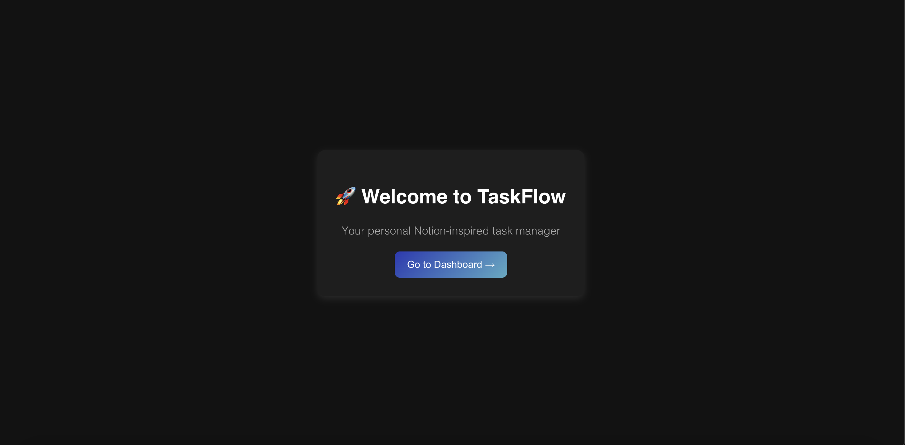
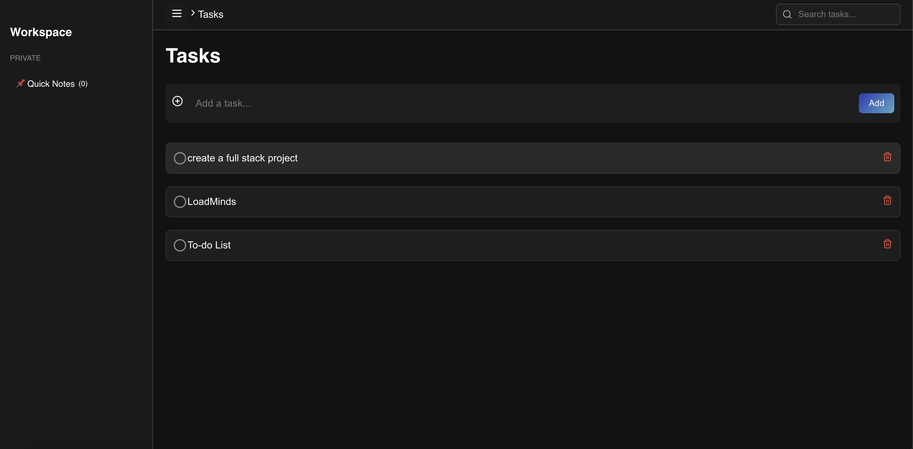
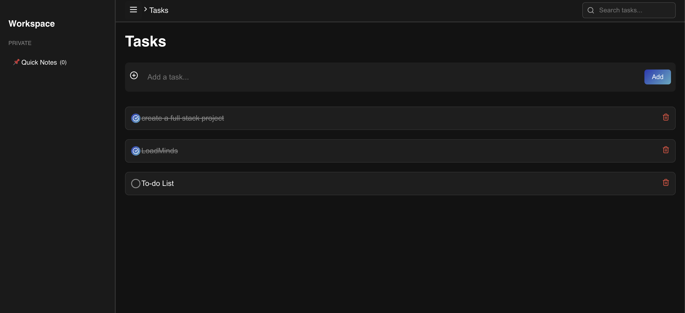
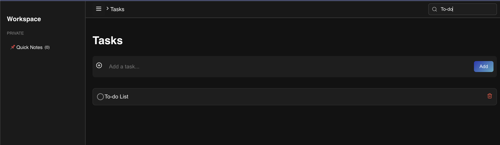
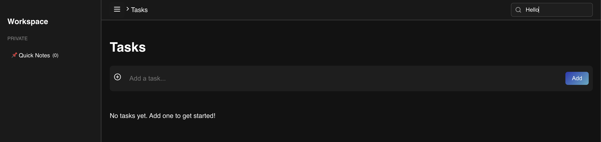
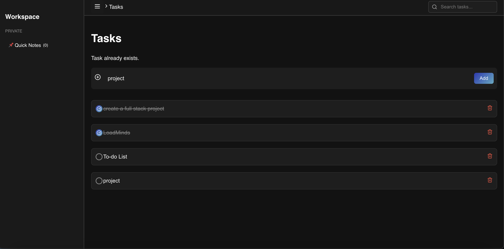
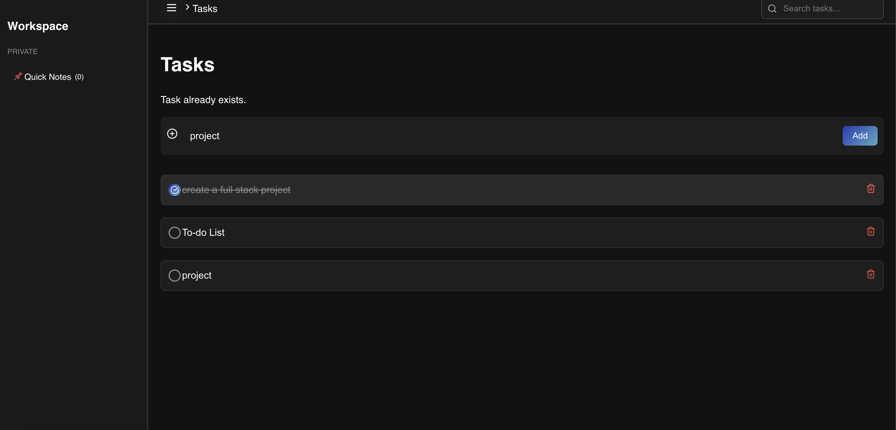
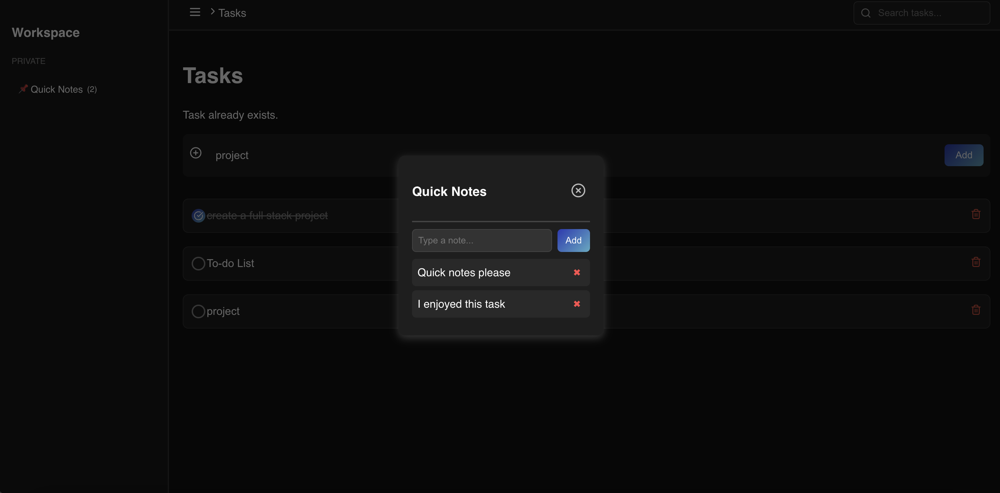
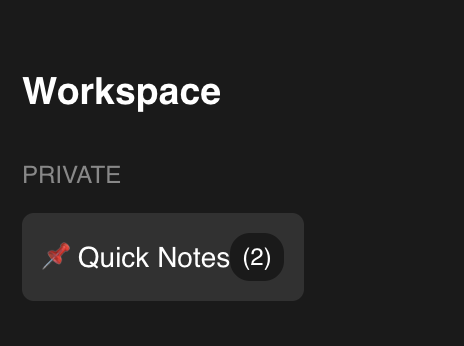

# 📝 TaskFlow - Full-Stack Task Management App  
TaskFlow is a **minimal yet powerful** task management application built with **React (Frontend)** and **Flask (Backend)**.  

### 📌 Landing Page  


### 📌 Dashboard


### 📌 Creating TaskList 


### 📌 Tasks Done 


### 📌 Search Action  


### 📌 Task Not Found 


### 📌 Task Landing Page  


### 📌 Task Already Exists 


### 📌 Quick Notes


### 📌 Real Time Updation of Quick Notes   


---

## 📌 Features
✅ **Task Management** – Add, Delete, Search, Complete Tasks  
✅ **Quick Notes Popup** – Save notes in `localStorage`  
✅ **Modern UI** – Notion-inspired design  
✅ **Flask API Backend** – Handles task operations  
✅ **Sidebar with Dynamic Note Count**  

---

## ⚙️ Tech Stack
### **Frontend (React)**
- 🏗 **React.js** – Component-based UI  
- 🔗 **Axios** – API requests  
- 🎨 **Lucide Icons** – UI icons  
- 🎭 **CSS** – Custom styling  

### **Backend (Flask)**
- 🐍 **Flask** – Python web framework  
- 🔄 **Flask-CORS** – Handles CORS requests  
- 🆔 **UUID** – Unique Task IDs  

---

## 🔧 Backend (Flask) Functionality  
The Flask backend provides an API to manage tasks with in-memory storage.  

✅ **Create, Fetch, Update, Delete Tasks**  
✅ **Mark Tasks as Completed**  
✅ **Prevent Duplicate Tasks**  

---

## 💻 Frontend (React) Functionality  
The frontend offers a **Notion-style UI** with dynamic features.  

### 📌 **Task Dashboard**  
- ✅ Displays tasks  
- ✅ Allows adding, deleting, and marking as complete  
- ✅ Search functionality  

### 📌 **Quick Notes**  
- ✅ Opens a popup modal  
- ✅ Saves notes to `localStorage`  
- ✅ Sidebar dynamically updates note count

## 🚀 Installation & Setup
### **1️⃣ Clone the Repository**
```sh
git clone https://github.com/aditisaxena259/taskflow.git
cd taskflow
```
## 🚀 Setup Instructions  

### **2️⃣ Backend Setup (Flask)**  
Run the following commands to set up and start the backend:  

```sh
cd backend
python3 -m venv venv   # Create virtual environment
source venv/bin/activate  # Activate it (Mac/Linux)
venv\Scripts\activate  # (For Windows)
pip install flask flask-cors  # Install dependencies
python app.py  # Start backend

cd frontend
npm install  # Install dependencies
npm start  # Start the frontend
```

### **Use the following curl command to add a new task via the API:**
```sh
curl -X POST http://127.0.0.1:5000/api/tasks -H "Content-Type: application/json" -d '{"title": "New Task"}'
```

